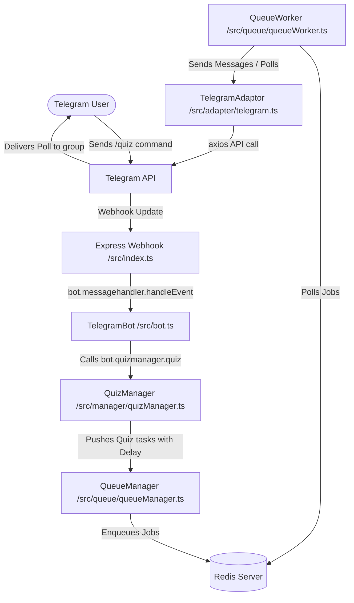

# ExamBuddy Telegram Bot

This is the main Telegram Bot project for **ExamBuddy**, designed to handle group management, subscription/prime verification, and interactive programming quizzes.

The bot is built on top of the custom `@subhajit60/bot` framework and leverages **BullMQ (Redis)** for asynchronous, restart-resilient, rate-limit friendly task scheduling.

---

## 🏗️ System Architecture

Below is a diagram showing how incoming Telegram updates are handled and how interactive quiz operations are enqueued and run:



---

## 📂 Project Structure

```bash
src/
├── adapter/
│   └── telegram.ts          # Extends IPlatformAdaptor; wraps Telegram API communication
├── manager/
│   ├── quizManager.ts       # Schedules questions & leaderboards, processes poll votes
│   └── userManager.ts       # Handles subscription verification & renewal checks
├── queue/
│   ├── queueManager.ts      # Wraps BullMQ Queue; exposes .push(task, options)
│   └── queueWorker.ts       # Listens to "task" queue & executes asynchronous operations
├── services/
│   ├── bot/
│   │   ├── QuestionService.service.ts  # Fetches questions from PostgreSQL via Drizzle
│   │   └── bot.telegram.service.ts     # Fetches group configurations & updates user premium status
│   └── bot.service.ts       # Main Service bundle exposing Telegram & Question subsystems
├── bot.ts                   # Custom TelegramBot extending IBot framework class
└── index.ts                 # Express webhook server & entry point
```

---

## ⚙️ Queue-Based Messaging Architecture (BullMQ)

To ensure the bot is **resilient to restarts** and doesn't hit **Telegram rate-limits** during high concurrency, all delayed actions (such as quiz timelines) are offloaded to **BullMQ** with Redis.

### Job/Task Payload Types

We utilize the following task types inside the `"task"` queue:

| Task Name | Payload Structure | Action Performed |
| :--- | :--- | :--- |
| `SEND_NOFTIFICATION` | `{ chatId, text, thread_id }` | Sends standard Markdown text message to a user or group |
| `SEND_HTML_NOFTIFICATION` | `{ chatId, text, thread_id }` | Sends HTML formatted messages (e.g. escaped code snippet blocks) |
| `SEND_POLL` | `{ poll: { chatId, data: { question, options, ansid, explanation, quizOpenFor }, quizId } }` | Sends an interactive poll and registers it back on the QuizManager |
| `SHOW_LEADERBOARD` | `{ quiz_id, chatid, thread_id }` | Triggered at the end of a quiz to compute user scores |
| `SEND_QUIZ_DATA` / `CREATE_QUIZ` | `{ chatId }` | Triggered externally to initialize a quiz for a group |

### The Quiz Timeline Flow

1. **Start**: A user runs `/quiz` or an external webhook enqueues `CREATE_QUIZ`.
2. **Setup**: `QuizManager` enqueues introduction messages (`SEND_NOFTIFICATION`).
3. **Question Scheduling**: `QuizManager` fetches questions from database via `QuestionService` and schedules:
   - Formatted Code block messages (`SEND_HTML_NOFTIFICATION`) with `delay: 3s + i * nextQuestionTime`.
   - Poll Questions (`SEND_POLL`) with `delay: 3s + i * nextQuestionTime + offset`.
4. **Leaderboard Trigger**: A `"SHOW_LEADERBOARD"` task is enqueued with a delay of `3s + total_questions * nextQuestionTime + 2 * quizOpenFor`.
5. **Score Collection**: When users vote in the polls, Telegram fires a `poll_answer` update. The bot's `handle_poll_answer` maps correct answers in `quizInfo` and scores them in `userAnswers`.
6. **Result**: Once `"SHOW_LEADERBOARD"` is triggered, the worker gathers final scores and enqueues a `"SEND_NOFTIFICATION"` winner announcement.

---

## 🛠️ Setup & Development Commands

### 1. Prerequisites
- **Node.js** (v18+)
- **Redis Server** (required for BullMQ backend)
- **PostgreSQL** database connection configured

### 2. Installation
Install dependencies:
```bash
npm install
```

### 3. Environment Variables
Create a `.env` file in the root based on `example.env`:
```env
PORT=4444
BOT_TOKEN=your_telegram_bot_token
WEBHOOK_URL=your_public_https_url
DATABASE_URL=postgresql://...
REDIS_URL=redis://127.0.0.1:6379
```

### 4. Build & Run
Compile TypeScript code and start the project:
```bash
# Build the project
npm run build

# Start the built files
npm start
```
