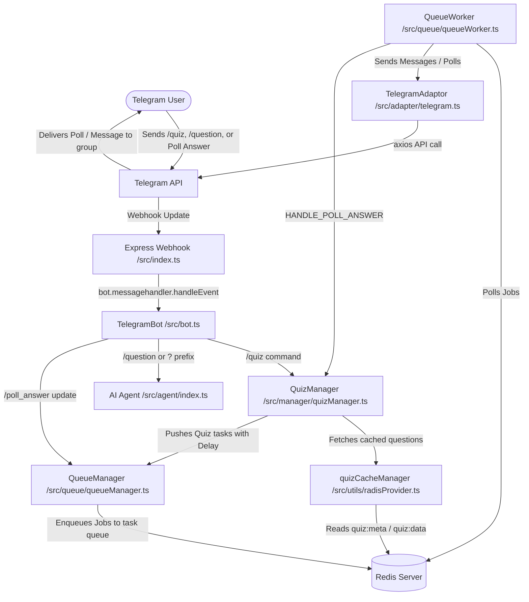

# ExamBuddy Telegram Bot

This is the main Telegram Bot project for **ExamBuddy**, designed to handle group management, subscription/prime verification, AI-powered question answering, and interactive programming quizzes.

The bot is built on top of the custom `@subhajit60/bot` framework and leverages **BullMQ (Redis)** for asynchronous, restart-resilient, rate-limit friendly task scheduling alongside an **AI Agent layer** (`@subhajit60/aiagent`).

---

## 🏗️ System Architecture

Below is a diagram showing how incoming Telegram updates are handled, how interactive quiz operations are enqueued and run, and how cached quiz data is served:



---

## 📂 Project Structure

```bash
src/
├── adapter/
│   └── telegram.ts          # Extends IPlatformAdaptor; wraps Telegram API communication
├── agent/
│   └── index.ts             # AI Agent setup using @subhajit60/aiagent & GeminiProvider
├── conversation/
│   └── feedback.ts          # Feedback conversation handler
├── db/
│   ├── schema/              # Drizzle ORM schemas (telegram, question, quiz, user, etc.)
│   └── index.ts             # Database client setup
├── manager/
│   ├── quizManager.ts       # Schedules questions & leaderboards, processes poll votes
│   └── userManager.ts       # Handles subscription verification & renewal checks
├── middlewere/
│   └── userAuth.ts          # Authorization middleware (isAdmin, isGroupValid)
├── queue/
│   ├── queueManager.ts      # Wraps BullMQ Queue singleton with allowedQueues filtering
│   └── queueWorker.ts       # Listens to "task" queue & executes asynchronous operations
├── services/
│   ├── bot/
│   │   ├── QuestionService.service.ts  # Database query helpers for programming questions
│   │   └── bot.telegram.service.ts     # Group configurations, ban user processing, & user prime status
│   └── bot.service.ts       # Main Service bundle exposing Telegram & Question subsystems
├── types/
│   ├── botTypes.ts          # Bot platform & handler types
│   ├── index.ts             # Update & context types
│   ├── quizTypes.ts         # Quiz question (exam_question_format_type, quiz_question_type) & score types
│   └── taskTypes.ts         # Task & job payload interfaces
├── utils/
│   ├── radisProvider.ts     # redisClient singleton, QuizJobQueue, TaskQueue, & quizCacheManager
│   ├── logger.ts            # Custom console logging utility
│   ├── network.ts           # Axios HTTP client helper
│   └── shuffle.ts           # Array shuffle helper
├── zod/
│   └── bot.zod.ts           # Zod validation schemas for ban/unban notifications
├── bot.ts                   # Custom TelegramBot extending IBot framework class with prefix mapping
└── index.ts                 # Express webhook server & entry point
```

---

## ⚙️ Queue-Based Messaging Architecture (BullMQ)

To ensure the bot is **resilient to restarts** and doesn't hit **Telegram rate-limits** during high concurrency, all delayed actions and poll answer tracking are offloaded to **BullMQ** with Redis.

### Job/Task Payload Types

We utilize the following task types inside the `"task"` queue:

| Task Name | Payload Structure | Action Performed |
| :--- | :--- | :--- |
| `SEND_NOFTIFICATION` | `{ chatId, text, thread_id }` | Sends standard Markdown text message to a user or group |
| `SEND_HTML_NOFTIFICATION` | `{ chatId, text, thread_id }` | Sends HTML formatted messages (e.g. escaped preformatted code blocks) |
| `SEND_POLL` | `{ poll: { number, chatId, data: { question, options, ansid, explanation, is_multiple_ans, quizOpenFor, thread_id }, quizId } }` | Sends an interactive poll and registers it back on the QuizManager |
| `SHOW_LEADERBOARD` | `{ quiz_id, chatid, thread_id }` | Triggered at the end of a quiz to compute user scores and accuracy percentages |
| `HANDLE_POLL_ANSWER` | `{ poll_id, options, userid, name, username }` | Processes poll answers asynchronously from webhook payload |
| `CREATE_QUIZ` | `{ chatId }` | Triggered externally or via queue to initialize a quiz for a group |
| `SEND_QUIZ_DATA` | `{ ... }` | Placeholder handler for external quiz data payloads |

### The Quiz Timeline Flow

1. **Start**: A user runs `/quiz` or an external webhook enqueues `CREATE_QUIZ`.
2. **Setup**: `QuizManager` enqueues introduction messages (`SEND_NOFTIFICATION`).
3. **Question Scheduling**: `QuizManager` fetches questions from Redis cache (`quizCacheManager.getQuizQuestions`) and schedules:
   - Formatted Code block messages (`SEND_HTML_NOFTIFICATION`) with `delay: 3s + i * nextQuestionTime`.
   - Poll Questions (`SEND_POLL`) with `delay: 3s + i * nextQuestionTime + 200ms`.
4. **Leaderboard Trigger**: A `"SHOW_LEADERBOARD"` task is enqueued with a delay of `3s + total_questions * nextQuestionTime + 2 * quizOpenFor`.
5. **Async Score Collection**: When users vote in polls, Telegram fires a `poll_answer` webhook update. `src/index.ts` normalizes it into a `/poll_answer` command and enqueues a `HANDLE_POLL_ANSWER` job to BullMQ. `QueueWorker` executes `handle_poll_answer` to update score tracking in `userAnswers`.
6. **Result**: Once `"SHOW_LEADERBOARD"` is triggered, the worker gathers final scores, calculates accuracy percentages, and enqueues a `"SEND_NOFTIFICATION"` winner announcement.

---

## ⚠️ Breaking Changes & Refactoring Highlights

1. **Redis Connection Singleton (`redisClient`)**:
   Replaced independent per-class `new Redis(...)` connection instantiations with a centralized `redisClient.getInstance().getClient()` singleton in [`src/utils/radisProvider.ts`](file:///p:/Project/exambuddys/telegram-bot/src/utils/radisProvider.ts).
2. **Redis Quiz Caching Layer (`quizCacheManager`)**:
   `QuizManager` now fetches questions via `quizCacheManager` (`quiz:data:<quiz_id>`) rather than querying PostgreSQL directly on every quiz execution.
3. **Async Poll Answer Queueing**:
   Incoming Telegram `poll_answer` webhook updates are enqueued as `HANDLE_POLL_ANSWER` tasks to BullMQ instead of being processed synchronously on the Express HTTP webhook request handler.
4. **Question Property Refactoring**:
   Updated `quiz_question_type` property `allows_multiple_answers` -> `is_multiple_ans`.

---

## 🛠️ Setup & Development Commands

### 1. Prerequisites
- **Node.js** (v18+)
- **Redis Server** (required for BullMQ backend and caching)
- **PostgreSQL** database connection configured

### 2. Installation
Install dependencies:
```bash
npm install
```

### 3. Environment Variables
Create a `.env` file in the root based on `example.env`:
```env
PORT=4444
BOT_TOKEN=your_telegram_bot_token
WEBHOOK_URL=your_public_https_url
DATABASE_URL=postgresql://...
REDIS_URL=redis://127.0.0.1:6379
```

### 4. Build & Run
Compile TypeScript code and start the project:
```bash
# Build the project
npm run build

# Start the built files
npm start
```

