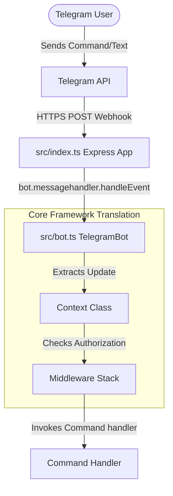

# System Architecture & Lifecycle

This document explains the high-level system architecture, entry points, and lifecycle of Telegram updates in the ExamBuddy bot.

---

## 🏗️ Technical Architecture Overview

The bot functions as a bridge between the Telegram Bot API and our application backend, utilizing a custom `@subhajit60/bot` core library.

---

## 🔌 Major Core Components

### 1. Webhook Entry Point (`src/index.ts`)
* Configures an Express server listening on a public port (e.g. `4444`).
* Receives incoming Telegram update payloads at the `/webhook` endpoint.
* Invokes `bot.messagehandler.handleEvent(new Context(update, telegramAdaptor))` to process the update.
* Houses command registration logic for `/start`, `/sendchatid`, `/sendthreadid`, `/quiz`, etc.

### 2. Platform Adaptor (`src/adapter/telegram.ts`)
* Implements the `IPlatformAdaptor` interface.
* Abstracts the Telegram HTTP request structure (using Axios) for actions like `sendMessage()`, `sendPoll()`, `sendHtmlMessage()`, and `banUser()`.
* Automatically registers the bot's secure HTTPS webhook URL with the Telegram API upon startup using `setWebhook()`.

### 3. Bot Interface Wrapper (`src/bot.ts`)
* Declares `TelegramBot` extending the base `IBot` class.
* Binds the specific `TelegramAdaptor` to `bot.platform` to provide full TypeScript typing and autocomplete.
* Bootstraps the sub-managers: `QuizManager` and `BotService` (incorporating database queries).

### 4. Context Normalization (`Context`)
* Normalizes incoming raw payloads from Telegram into a platform-agnostic format (e.g. `chatId`, `userId`, `text`, `type`, `raw`).
* Exposes utility helpers:
  * `ctx.reply(message)` -> translates into sending a Telegram message to the current chat ID.
  * `ctx.sendPoll(poll)` -> translates into issuing a native group poll.
