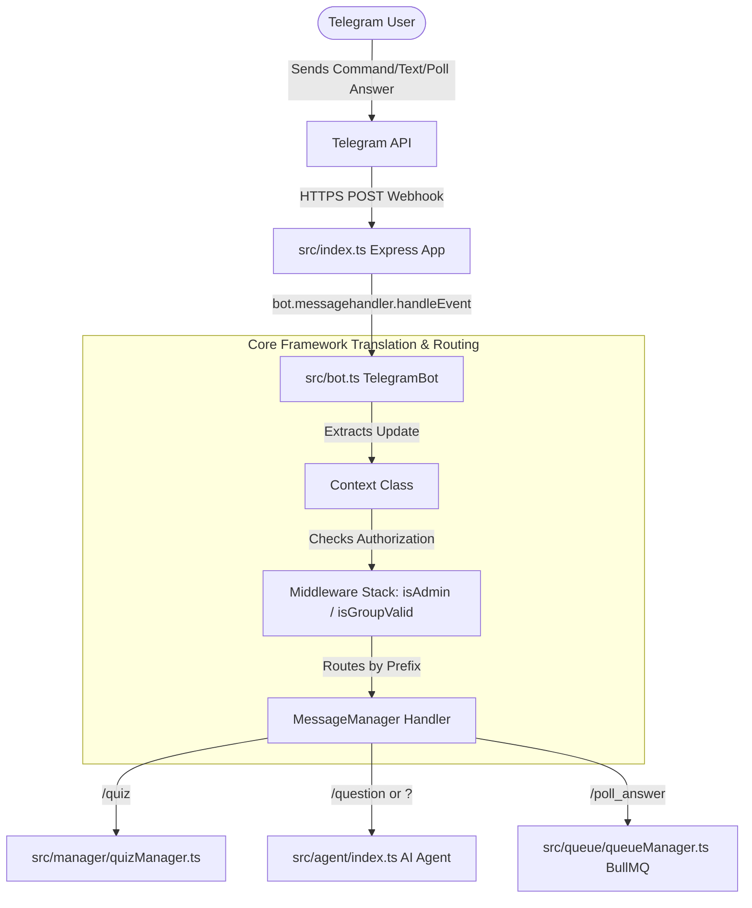

# System Architecture & Lifecycle

This document explains the high-level system architecture, entry points, update lifecycle, and core module integrations in the ExamBuddy Telegram Bot.

---

## 🏗️ Technical Architecture Overview

The bot functions as a bridge between the Telegram Bot API and our application backend, utilizing a custom `@subhajit60/bot` core library, BullMQ job scheduling, Redis caching, Drizzle ORM database layer, and `@subhajit60/aiagent` AI capabilities.

---

## 🔌 Major Core Components

### 1. Webhook Entry Point (`src/index.ts`)
* Configures an Express server listening on a public port (configured via `PORT`, defaulting to `4444`).
* Receives incoming Telegram update payloads at the `/webhook` endpoint.
* Parses and normalizes incoming updates into three primary event forms:
  1. **Poll Answer Updates (`update.poll_answer`)**: Normalized into a `/poll_answer` command with payload containing `poll_id`, `options` (`option_ids`), `userid`, `name`, and `username`. Automatically enqueues a `HANDLE_POLL_ANSWER` task to the BullMQ queue for asynchronous non-blocking score processing.
  2. **New Member Events (`update.new_chat_members`)**: Extracted as `new_member` event types.
  3. **Standard Chat Messages (`update.message`)**: Extracted into commands and arguments using `messageExtractor`.
* Houses command registration logic for `/start`, `/sendchatid`, `/sendthreadid`, `/quiz`, `/question`, `/sendMyId`, `/poll_answer`, and error reporting commands (`!Error`).

### 2. Command Prefix & Routing Setup (`src/bot.ts`)
The `TelegramBot` class initializes `messageManager` with explicit command prefix mappings:
* `/` -> `command` (e.g. `/start`, `/quiz`, `/sendchatid`)
* `?` -> `question` (e.g. `?question`)
* `!` -> `error` (e.g. `!Error 20`)
* ` ` -> `message` (standard text messages)

### 3. Authorization & Verification Middleware (`src/middlewere/userAuth.ts`)
* **`isAdmin(ctx)`**: Verifies whether the requesting user is an authorized admin before executing privileged commands like `/sendchatid` or `/sendthreadid`.
* **`isGroupValid(ctx)`**: Validates if the target group chat is authorized and registered in the database via `BotTelegramService.getValidChatIds()` before allowing commands like `/quiz`.

### 4. Platform Adaptor (`src/adapter/telegram.ts`)
* Implements the `IPlatformAdaptor` interface.
* Abstracts Telegram HTTP API interactions (using Axios) for actions like `sendMessage()`, `sendPoll()`, `sendHtmlMessage()`, and `banUser()`.
* Automatically registers the bot's secure HTTPS webhook URL with the Telegram API upon startup using `setWebhook()`.

### 5. AI Agent Subsystem (`src/agent/index.ts`)
* Leverages `@subhajit60/aiagent` to provide intelligent Q&A functionality.
* Initialized with `GeminiProvider` running model `gemini-3.5-flash`, `ConversationMemory`, and a `ToolRegistry`.
* Invoked when users trigger the `/question` command or `?` prefix.

### 6. Bot Interface & Sub-Managers (`src/bot.ts`)
* Declares `TelegramBot` extending the base `IBot` class.
* Binds `TelegramAdaptor` to `bot.platform`.
* Bootstraps sub-managers: `QuizManager`, `BotService` (PostgreSQL via Drizzle ORM), `QueueManager` (BullMQ Redis queues), and `quizCacheManager` (Redis cache).

